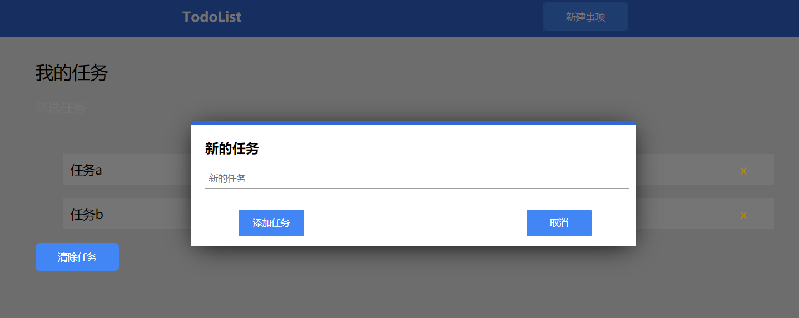

# 纯前端实现 TodoList

## 前端练手项目之一

### 技术栈

- HTML
- CSS
- JavaScript

### 项目目录结构
TodoList/ 
├─css/
│    └── index.css
├──img/
│     └──添加界面.PNG
│     └──显示界面.PNG
├─js/ 
│   └──add_window.js
│   └──index.js
├── index.html
└── README.md

###简单介绍   

**界面截图**

说明：
- 添加任务
- 删除任务
- 筛选任务
- 清除任务
